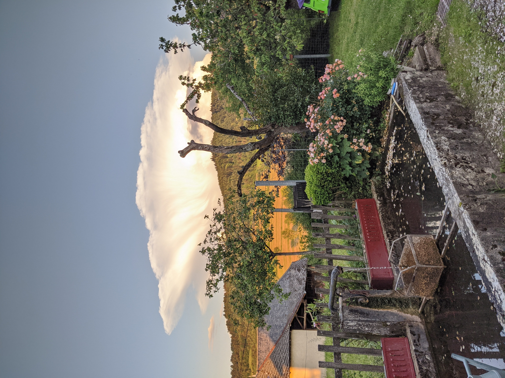
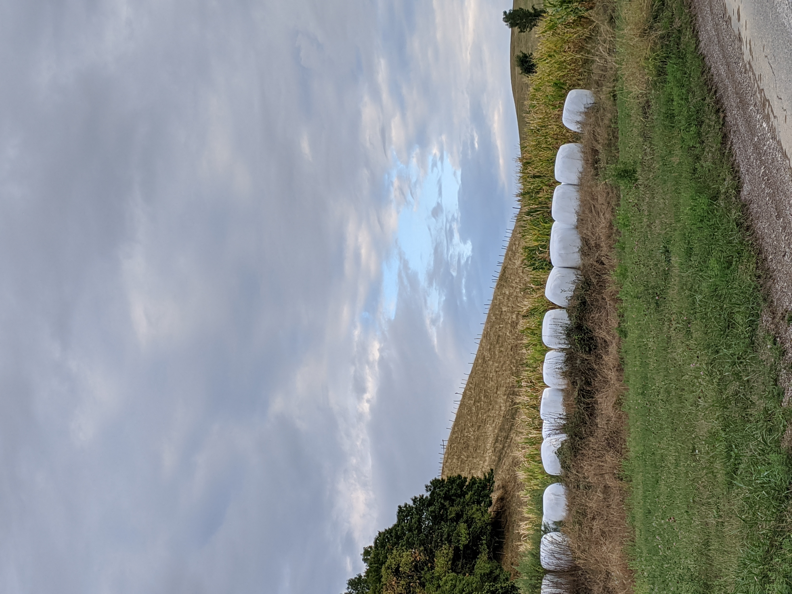
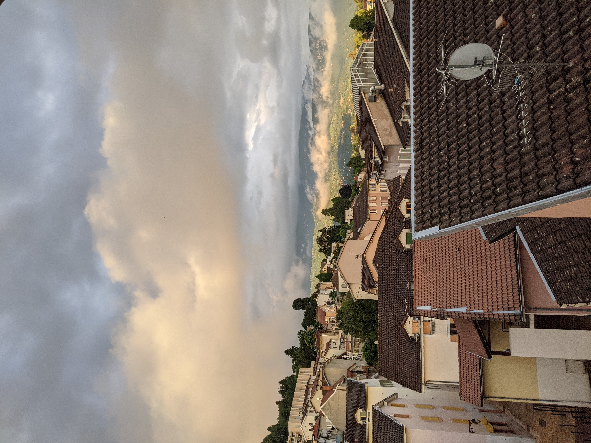

<html lang="en">

 <head>
  <meta charset="utf-8">
  
  <title>Image Gallery</title>
  <meta name="description" content="Responsive Image Gallery">
  <meta name="author" content="Tim Wells">
  
  
</head>
<body>

 
   
   
   
   
   
   
   
   
     
   
   
   
   
   
   
   
   
   
   
   
   
   
   
   
     
   
  

 
 </body>
</html>
